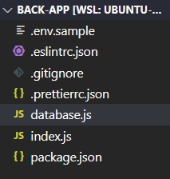
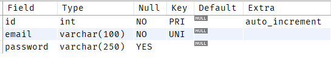
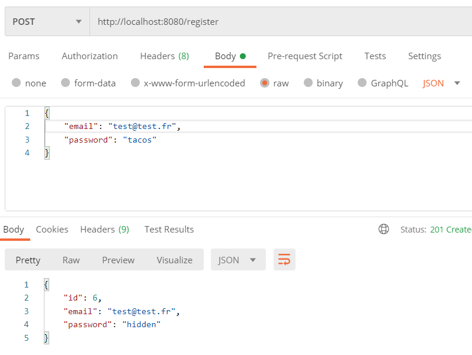
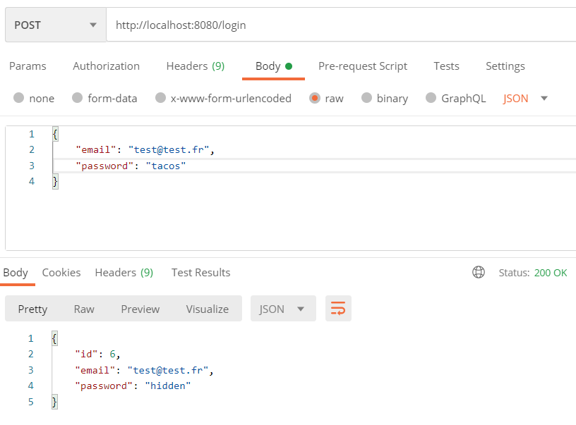
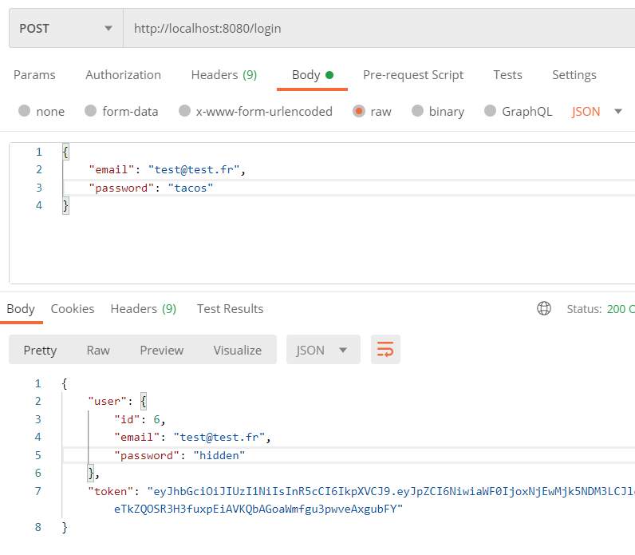
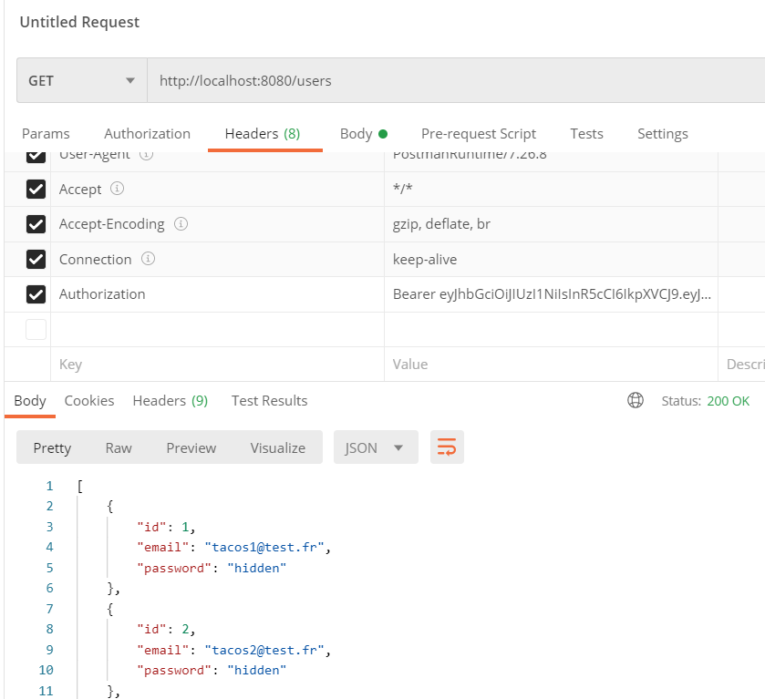

_Fork_ ce _boilerplate_ afin de démarrer le tutoriel : [https://github.com/bastienwcs/nodejs-jwt-boilerplate](https://github.com/bastienwcs/nodejs-jwt-boilerplate).



## 0 - Configuration

### Base de données

Afin de gérer l'inscription et la connexion d'utilisateurs, crée une nouvelle base de données nommée `jwtcourse` et crée la table `user` en respectant cette modélisation :



### Variables d'environnements

Dans le projet, copie le fichier `.env.sample` vers `.env` et modifie les variables d'environnements correspondantes à la base de données.

### Installation

Pense à installer le projet avec `npm install` avant de démarrer !

## 1 - Création d'un compte utilisateur

Créer une route en POST `/register` qui va permettre la création d'un compte utilisateur.

La route doit récupérer du corps de la requête un json à la structure suivante :

```json
{
  "email": "son email",
  "password": "son mot de passe"
}
```

Si l'email ou le mot de passe ne sont pas renseignés, renvoyer une erreur 400 'Please specify both email and password'.

Dans le cas où ils sont renseignés, faire une requête à la base de données et insérer les données dans la table `user`.

Si une erreur survient lors de l'exécution de la requête SQL, renvoyer une erreur 500 avec le message d'erreur correspondant.

Si tout c'est bien passé, renvoyer un code 201 avec un json ayant la structure suivante :

```json
{
  "id": "son id",
  "email": "son email",
  "password": "hidden"
}
```

> Ne pas renvoyer le mot de passe renseigné mais la chaîne de caractère "hidden"

Teste le tout avec Postman :

- POST http://localhost:8080/register
- Body / raw / JSON
- Dans le corps de la requête un JSON, par exemple :

```json
{
  "email": "test@test.fr",
  "password": "tacos"
}
```



### Solution

> **Attention** : essaie de faire l'exercice par toi-même avant de regarder la solution !

-
-
-
-
-
-
-
-
-
-
-
-

```js
app.post('/register', (req, res) => {
  const { email, password } = req.body;
  if (!email || !password) {
    res
      .status(400)
      .json({ errorMessage: 'Please specify both email and password' });
  } else {
    connection.query(
      `INSERT INTO user(email, password) VALUES (?, ?)`,
      [email, password],
      (error, result) => {
        if (error) {
          res.status(500).json({ errorMessage: error.message });
        } else {
          res.status(201).json({
            id: result.insertId,
            email,
            password: 'hidden',
          });
        }
      }
    );
  }
});
```

## 2 - Hashage du mot de passe

Il est très dangereux de laisser le mot de passe de l'utilisateur _en clair_ dans une base de données.

Regarde le lien suivant pour voir comment _hasher_ le mot de passe avec la bibliothèque _bcrypt_ : [https://www.abeautifulsite.net/hashing-passwords-with-nodejs-and-bcrypt](https://www.abeautifulsite.net/hashing-passwords-with-nodejs-and-bcrypt).

Installe le module [bcrypt](https://www.npmjs.com/package/bcrypt) dans ton projet.

Ensuite modifie ta route `/register` pour crypter le mot de passe de façon synchrone, **avant** qu'il ne soit enregistré dans la base de données.

Vérifie que le mot de passe est bien encrypté dans la base de donnée.

> Pense à importer le module en haut de ton fichier !

### Solution

> **Attention** : essaie de faire l'exercice par toi-même avant de regarder la solution !

-
-
-
-
-
-
-
-
-
-
-
-

```js
app.post('/register', (req, res) => {
  const { email, password } = req.body;
  if (!email || !password) {
    res
      .status(400)
      .json({ errorMessage: 'Please specify both email and password' });
  } else {
    const hash = bcrypt.hashSync(password, 10);
    connection.query(
      `INSERT INTO user(email, password) VALUES (?, ?)`,
      [email, hash],
      (error, result) => {
        if (error) {
          res.status(500).json({ errorMessage: error.message });
        } else {
          res.status(201).json({
            id: result.insertId,
            email,
            password: 'hidden',
          });
        }
      }
    );
  }
});
```

## 3 - Connexion au compte utilisateur

Créer une route en POST `/login` qui va permettre la connexion d'un compte utilisateur.

La route doit récupérer du corps de la requête un json à la structure suivante :

```json
{
  "email": "son email",
  "password": "son mot de passe"
}
```

Si l'email ou le mot de passe ne sont pas renseignés, renvoyer une erreur 400 'Please specify both email and password'.

Dans le cas où ils sont renseignés, faire une requête à la base de données et vérifier que l'email existe bien (**tester l'email uniquement, pas le mot de passe !**).

Si une erreur survient lors de l'exécution de la requête SQL, renvoyer une erreur 500 avec le message d'erreur correspondant.

Si le résultat renvoyé est vide, renvoyer une erreur 403 'Invalid email'.

Si le résultat n'est pas vide, tu vas maintenant vérifier le mot de passe en utilisant la méthode `compareSync` du module _bcrypt_. Tu peux trouver un exemple d'utilisation ici : [https://www.abeautifulsite.net/hashing-passwords-with-nodejs-and-bcrypt](https://www.abeautifulsite.net/hashing-passwords-with-nodejs-and-bcrypt).

> Attention, il faut mettre le mot de passe _en clair_ en premier argument et le mot de passe de la base de données en second

Si tout le mot de passe est identique, renvoyer un code 200 avec un json ayant la structure suivante :

```json
{
  "id": "son id",
  "email": "son email",
  "password": "hidden"
}
```

Sinon renvoie une erreur 403 avec le message 'Invalid password'.

Teste le tout avec Postman :

- POST http://localhost:8080/login
- Body / raw / JSON
- Dans le corps de la requête un JSON, par exemple :

```json
{
  "email": "test@test.fr",
  "password": "tacos"
}
```



### Solution

> **Attention** : essaie de faire l'exercice par toi-même avant de regarder la solution !

-
-
-
-
-
-
-
-
-
-
-
-

```js
app.post('/login', (req, res) => {
  const { email, password } = req.body;
  if (!email || !password) {
    res
      .status(400)
      .json({ errorMessage: 'Please specify both email and password' });
  } else {
    connection.query(
      `SELECT * FROM user WHERE email=?`,
      [email],
      (error, result) => {
        if (error) {
          res.status(500).json({ errorMessage: error.message });
        } else if (result.length === 0) {
          res.status(403).json({ errorMessage: 'Invalid email' });
        } else if (bcrypt.compareSync(password, result[0].password)) {
          // Passwords match
          const user = {
            id: result[0].id,
            email,
            password: 'hidden',
          };
          res.status(200).json(user);
        } else {
          // Passwords don't match
          res.status(403).json({ errorMessage: 'Invalid password' });
        }
      }
    );
  }
});
```

## 4 - Création d'un JSON Web Token

Tu rentres enfin dans le vif du sujet : la génération du JWT grâce à une clef secrète.

Commence par renseigner une clé secrète dans le fichier `.env`. Tu peux générer une clé sécurisée ici : [https://www.grc.com/passwords.htm](https://www.grc.com/passwords.htm).

Ensuite, tu vas utiliser le module [jsonwebtoken](https://www.npmjs.com/package/jsonwebtoken) pour effectuer la génération de la clé :

- installe le module
- utilise la méthode `sign` afin de générer un JWT, en utilisant la clé secrète des variables d'environnement.
- Le _payload_ de la clé sera le json suivant : `json { id: user.id } `
- la date d'expiration `expiresIn` sera de 5 minutes.

Génère la clé juste avant de renvoyer utilisateur dans la route `/login` et fait en sorte que la structure du JSON soit la suivante :

```json
{
  "user": {
    "id": "son id",
    "email": "son email",
    "password": "hidden"
  },
  "token": "le token généré"
}
```



### Solution

> **Attention** : essaie de faire l'exercice par toi-même avant de regarder la solution !

-
-
-
-
-
-
-
-
-
-
-
-

```js
app.post('/login', (req, res) => {
  const { email, password } = req.body;
  if (!email || !password) {
    res
      .status(400)
      .json({ errorMessage: 'Please specify both email and password' });
  } else {
    connection.query(
      `SELECT * FROM user WHERE email=?`,
      [email],
      (error, result) => {
        if (error) {
          res.status(500).json({ errorMessage: error.message });
        } else if (result.length === 0) {
          res.status(403).json({ errorMessage: 'Invalid email' });
        } else if (bcrypt.compareSync(password, result[0].password)) {
          // Passwords match
          const user = {
            id: result[0].id,
            email,
            password: 'hidden',
          };
          const token = jwt.sign({ id: user.id }, JWT_AUTH_SECRET, {
            expiresIn: 300,
          });
          res.status(200).json({ user, token });
        } else {
          // Passwords don't match
          res.status(403).json({ errorMessage: 'Invalid password' });
        }
      }
    );
  }
});
```

## 5 - Afficher la liste des utilisateurs

Créer une route en GET `/users` qui récupère la liste des utilisateurs.

Si une erreur survient lors de l'exécution de la requête SQL, renvoyer une erreur 500 avec le message d'erreur correspondant.

Si tout c'est bien passé, renvoyer un code 200 avec un json ayant la structure suivante :

```json
[
  {
    "id": 1,
    "email": "test@test.fr",
    "password": "hidden"
  },
  {
    "id": 2,
    "email": "tacos@test.fr",
    "password": "hidden"
  }
]
```

> Pense à cacher le mot de passe de chaque utilisateur !

### Solution

> **Attention** : essaie de faire l'exercice par toi-même avant de regarder la solution !

-
-
-
-
-
-
-
-
-
-
-
-

```js
app.get('/users', (req, res) => {
  connection.query(`SELECT * FROM user`, (error, result) => {
    if (error) {
      res.status(500).json({ errorMessage: error.message });
    } else {
      res.status(200).json(
        result.map((user) => {
          return { ...user, password: 'hidden' };
        })
      );
    }
  });
});
```

## 6 - Création d'un middleware d'authentification

Afin de protéger la route `/users` pour que seuls les utilisateurs authentifiés puissent y accéder, tu vas créer un _middleware_ qui va récupérer l'entête de la requête et y regarder la présence d'un _token_.

Pour cette partie là, le _middleware_ est fourni et est à ajouter **avant** la route `/users` :

```js
const authenticateWithJsonWebToken = (req, res, next) => {
  if (req.headers.authorization !== undefined) {
    const token = req.headers.authorization.split(' ')[1];
    jwt.verify(token, JWT_AUTH_SECRET, (err) => {
      if (err) {
        res
          .status(401)
          .json({ errorMessage: "you're not allowed to access these data" });
      } else {
        next();
      }
    });
  } else {
    res
      .status(401)
      .json({ errorMessage: "you're not allowed to access these data" });
  }
};
```

Tu vas devoir modifier la route user afin qu'elle charge ce _middleware_, puis tester la route avec Postman en renseignant l'entête suivante : `Authorization: Bearer eyJhbG.. ...8RvKts`

Bien sûr, il faudra remplacer le _token_ par celui récupéré lors de la connexion de l'utilisateur dans l'étape 4.



### Solution

> **Attention** : essaie de faire l'exercice par toi-même avant de regarder la solution !

-
-
-
-
-
-
-
-
-
-
-
-

```js
// Token middleware
const authenticateWithJsonWebToken = (req, res, next) => {
  if (req.headers.authorization !== undefined) {
    const token = req.headers.authorization.split(' ')[1];
    jwt.verify(token, JWT_AUTH_SECRET, (err) => {
      if (err) {
        res
          .status(401)
          .json({ errorMessage: "you're not allowed to access these data" });
      } else {
        next();
      }
    });
  } else {
    res
      .status(401)
      .json({ errorMessage: "you're not allowed to access these data" });
  }
};

// Authenticated route
app.get('/users', authenticateWithJsonWebToken, (req, res) => {
  connection.query(`SELECT * FROM user`, (error, result) => {
    if (error) {
      res.status(500).json({ errorMessage: error.message });
    } else {
      res.status(200).json(
        result.map((user) => {
          return { ...user, password: 'hidden' };
        })
      );
    }
  });
});
```
